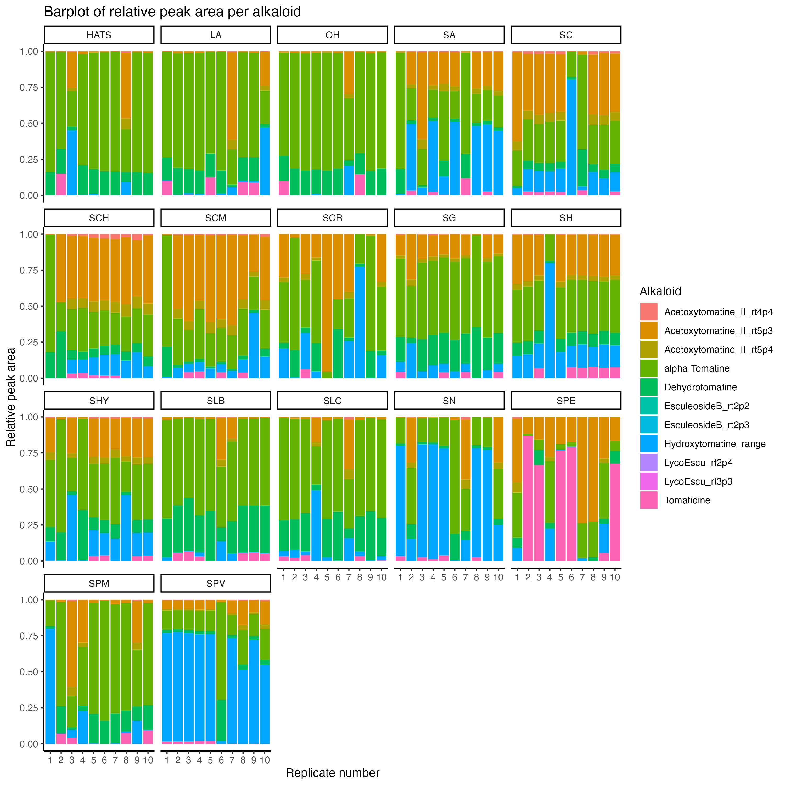

# tomato_leaves_alkaloids

<!-- badges: start -->

<!-- badges: end -->

The goal of tomato_leaves_alkaloids is to analyze the alkaloids present in seventeen tomato accessions.

# Analysis notebooks

In this repository, you will find two notebooks:

-   Targeted extraction analysis [notebook](https://github.com/CooperstoneLab/tomato_leaves_alkaloids/blob/main/Alkaloids_report.ipynb)
-   Results visualization and PCA analysis [notebook](https://github.com/CooperstoneLab/tomato_leaves_alkaloids/blob/main/Alkaloids_visualization.html)

Unfortunately, github does not support interactive plots. Therefore, in order to open the notebook containing the visualization and PCA results, you will need to download the *.html* notebook and open locally in your browser of preference (firefox, safari, chrome).

# Main results

In the results sections, you will find the tables with the peak ares of the alkaloids of interest. You can download this data in two types of formats:

-   Wide table [csv](https://github.com/CooperstoneLab/tomato_leaves_alkaloids/blob/main/Results/wide_Alkaloids_allSamples.csv)
-   Long table [csv](https://github.com/CooperstoneLab/tomato_leaves_alkaloids/blob/main/Results/All_samples_fixed_rt.csv)

